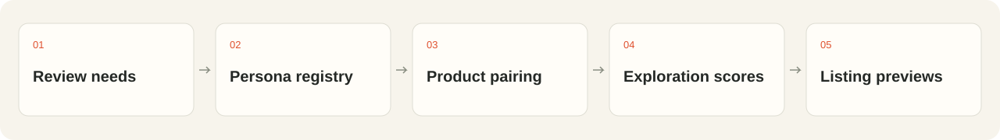
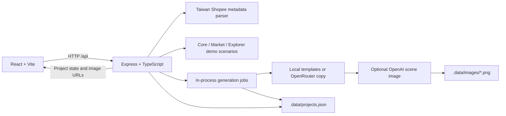

<p align="center">
  
</p>

<p align="center">
  <strong>English</strong> · <a href="README.zh-TW.md">繁體中文</a> · <a href="#demo">Demo</a> · <a href="#quick-start">Quick start</a> · <a href="docs/README.md">Docs</a>
</p>

<p align="center">
  <a href="package.json"></a>
  <a href="#quick-start"></a>
  <a href="#license"></a>
</p>

**Shopee Persona Engine helps sellers turn one product into 5–10 audience-specific listing previews.** Bring in product facts, choose audience scenarios, then compare, edit, favorite and copy candidate listings in a simulated Shopee layout.

The current app runs locally with a Traditional Chinese interface. Audience discovery uses labeled demo scenarios. Copy works without an API key; model-written copy and generated scene images are optional.

## The problem

A listing can describe what a product is without showing how it fits a buyer's day. Sellers need a way to try different communication angles while keeping price, specifications and other product facts visible for review.

## The approach

Persona Engine puts those alternatives in the same workspace. Each selected audience gets its own title and description, with desktop and mobile previews and a comparison against another version or the original listing. Sellers review the content before copying it out. The app does not publish to Shopee.



## Demo

Run the [local demo](#quick-start), click **「載入示範商品」** (Load demo product), then **「開始探索受眾」** (Explore audiences). Keep the five preselected directions and click **「生成 5 個商品頁」** (Generate 5 listing pages).

The example uses open-ear headphones. The **parents/caregivers** direction illustrates a “Missed Buyer”: someone interested in listening while remaining aware of family sounds. It carries a **user-provided summary of 13 matching reviews, all marked Verified Purchase, for one representative product**. Review text, source links, brand and model have not been supplied; the app has not independently verified that summary. This is a communication hypothesis, not evidence of purchase intent for the current product.

Brand, price and detailed specifications remain unspecified. The product illustration is a category illustration.


*Captured from the local app with template copy and image generation disabled. The UI is in Traditional Chinese; the headphones shown are the bundled illustration.*

<details>
<summary>Audience selection, original comparison and mobile preview</summary>


</details>

No hosted demo or recording is linked in this repository. See the [demo guide](docs/demo.md) for a walkthrough and the reserved GIF capture plan.

## Quick start

Use **Node.js 24** and npm. The original project validation used Node.js 24; this documentation pass also ran the tests and build on Node.js 26.5.0.

```bash
git clone https://github.com/c-cf/shopee-persona-engine.git
cd shopee-persona-engine
npm ci
npm run dev
```

Open **[http://127.0.0.1:5173](http://127.0.0.1:5173)**. The API listens on port **3001**; Vite proxies `/api` to it. With neither provider key configured, the demo uses local copy templates and the original product image, with no paid model requests.

For your own product, try a Taiwan Shopee URL or choose **「手動輸入」** (Manual input). Supply a title of at least 2 characters and a description of at least 8 characters. Price and image are optional; missing values stay visibly incomplete. URL parsing reads public metadata and may fail; use manual input when it does.

### Optional models

```bash
cp .env.example .env
```

Set `OPENROUTER_API_KEY` for model-written copy, `OPENAI_API_KEY` for audience scene images, or both. Restart the server after changing `.env`; its values override inherited environment variables. **Adding keys does not enable research-based audience discovery.**

See [configuration](docs/configuration.md) for model defaults, provider inputs, retries, image storage and deployment constraints. Provider integrations are implemented, but real-key calls were not verified in this documentation pass.

### Checks and production build

```bash
npm test
npm run build
npm start
```

After building, open **[http://127.0.0.1:3001](http://127.0.0.1:3001)**. Express serves the built frontend and API together. This is a local production build, not a hosted deployment.

## Features

| Capability | Current behavior |
| --- | --- |
| Product input | Taiwan Shopee public metadata, manual text and an optional PNG/JPG/WebP upload up to 1.3 MB |
| Audience selection | Three groups of five demo scenarios; select 5–10 distinct audiences |
| Listing generation | One title and description per audience; template copy or optional OpenRouter copy |
| Audience images | Optional text-prompted OpenAI image per audience; copy becomes editable before the image finishes |
| Review workspace | Desktop/mobile layouts; compare two variants or compare with the original |
| Editing | Autosave, restore original copy, favorites and copy current text |
| Reselection | Add or remove audiences; previously edited versions return when reselected |
| Export | Copy the current page as JSON, including current text, product, audience and image metadata |
| Recovery | Seven-day local project retention, same-browser return, persisted progress and retries for failed work |

## Architecture



The frontend and backend share TypeScript contracts. Audience preparation and variant generation run inside the server process; JSON checkpoints allow unfinished work to resume after a restart. This version has no external job queue, database service or account system.

Generated images use product facts, audience context and listing text as prompts. **The original product image is not sent as an image input**, so generated scenes do not guarantee an exact product likeness. [Architecture and data flow →](docs/architecture.md)

## Persona Engine and Explorer Engine

“Persona Engine” names the application. Its planned research pipeline is broader than the current demo implementation.

| Layer | Intended role | Implemented today |
| --- | --- | --- |
| Core | Suggest audiences directly related to the product's use | Five seeded scenarios |
| Market | Surface needs supported by review evidence | Five seeded scenarios; one supplied evidence summary in the exact headphone demo |
| Explorer | Explore less obvious contexts across a persona universe | Five seeded hypotheses; no 10K inference |
| Persona Factory / Universe | Build a versioned collection of personas; original target: 10,000 | Not connected |

The `core`, `market` and `explorer` group identifiers describe the demo's organization. They do not indicate that three research engines are running. [Methodology and evidence boundaries →](docs/methodology.md)

## Methodology and ranking formula

The current code uses a **default-selection rule**, not a market ranking model:

```text
priority(buyer) = 1 if buyer.evidence exists, otherwise 0
preselected = first 5 of a stable descending sort by priority
```

Ties retain seed order. For the exact headphone demo, selection initializes after Market is ready: the parents/caregivers entry comes first, followed by the first four Core entries. For other products, it initializes after Core is ready. User changes are preserved as later groups arrive.

There is no implemented fit score, novelty score, uplift estimate, vector retrieval or weighted ranking formula. An evidence object receives priority because it exists, not because the app has graded its quality. The [methodology note](docs/methodology.md) records the code paths and research work still needed.

## Project structure

```text
.
├── src/                    # React flow, preview renderer, API client and styles
├── server/                 # Express API, demo engine, generation, images and tests
├── shared/                 # Shared types, demo product and single-page JSON export
├── public/                 # App favicon and bundled product illustrations
├── docs/
│   ├── assets/brand/       # SVG mark, wordmark, bilingual hero and workflow
│   ├── assets/screenshots/ # Captures from the running local demo
│   └── adr/                # Original scope decisions
├── CONTEXT.md              # Domain vocabulary
├── CONTRIBUTING.md
├── README.md               # English homepage
└── README.zh-TW.md          # Traditional Chinese homepage
```

`.data/` (saved projects and images), `.env` and build output are ignored by Git. The [documentation index](docs/README.md) separates current guides from historical design notes.

## Project status

The current version supports the complete listing review and editing workflow. It has no Shopee login, Seller Center integration, live publishing, review corpus, vector search or complete 10K Explorer. It does not measure conversion lift.

Projects expire seven days after creation. Return access depends on the same browser's workspace key. Image links use random IDs but do not require that key; anyone who has a valid link can retrieve the image until expiry. Public hosting needs additional access and deployment decisions. [Operational details →](docs/configuration.md)

## Roadmap

The first two items reflect implemented scope. The remaining items are follow-up directions from the design notes and documentation audit, without committed dates.

- [x] Product input, demo audiences and 5–10 editable listing previews.
- [x] Optional copy/image providers, saved edits and failure recovery.
- [ ] Add review text, source links and reproducible evidence extraction.
- [ ] Connect a versioned Persona Factory / Universe and retrieval pipeline.
- [ ] Implement and evaluate the full Explorer; define any ranking formula before reporting scores.
- [ ] Measure real-provider latency, cost and factual accuracy; publish the evaluation setup.
- [ ] Decide hosting, access controls and durable storage requirements.
- [ ] Confirm the project license and publish a recorded demo.

## Team and hackathon

Built as a Shopee hackathon project in the [c-cf repository](https://github.com/c-cf/shopee-persona-engine). The first version prioritizes the seller's complete review workflow: product facts → audience choices → editable previews. See [the scope decision](docs/adr/0002-hackathon-first-version.md).

The repository does not yet document a team roster, member roles or an event edition. The [contributor history](https://github.com/c-cf/shopee-persona-engine/graphs/contributors) is the available code attribution; it should not be treated as the full hackathon team roster.

## Contributing

See [CONTRIBUTING.md](CONTRIBUTING.md). Useful contributions include reproducible bug reports, tests for editing and recovery, source-backed evidence fixtures, and English/Traditional Chinese documentation fixes. Keep demo behavior distinct from research claims.

## License

**No license file is present.** Public source availability does not establish an open-source license. The maintainers still need to choose and add terms for the code and assets; this documentation change does not assign one. Shopee is referenced as the target marketplace, not as a claim of endorsement.
