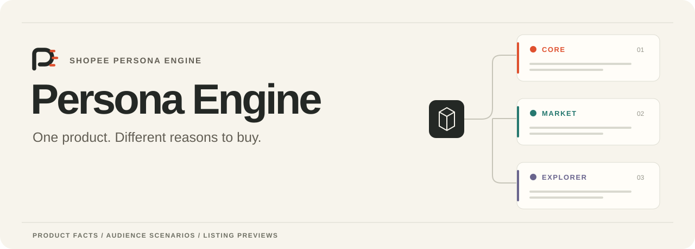
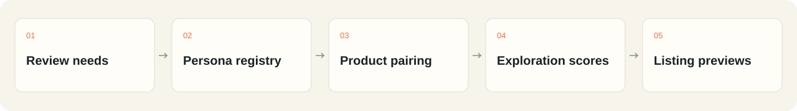
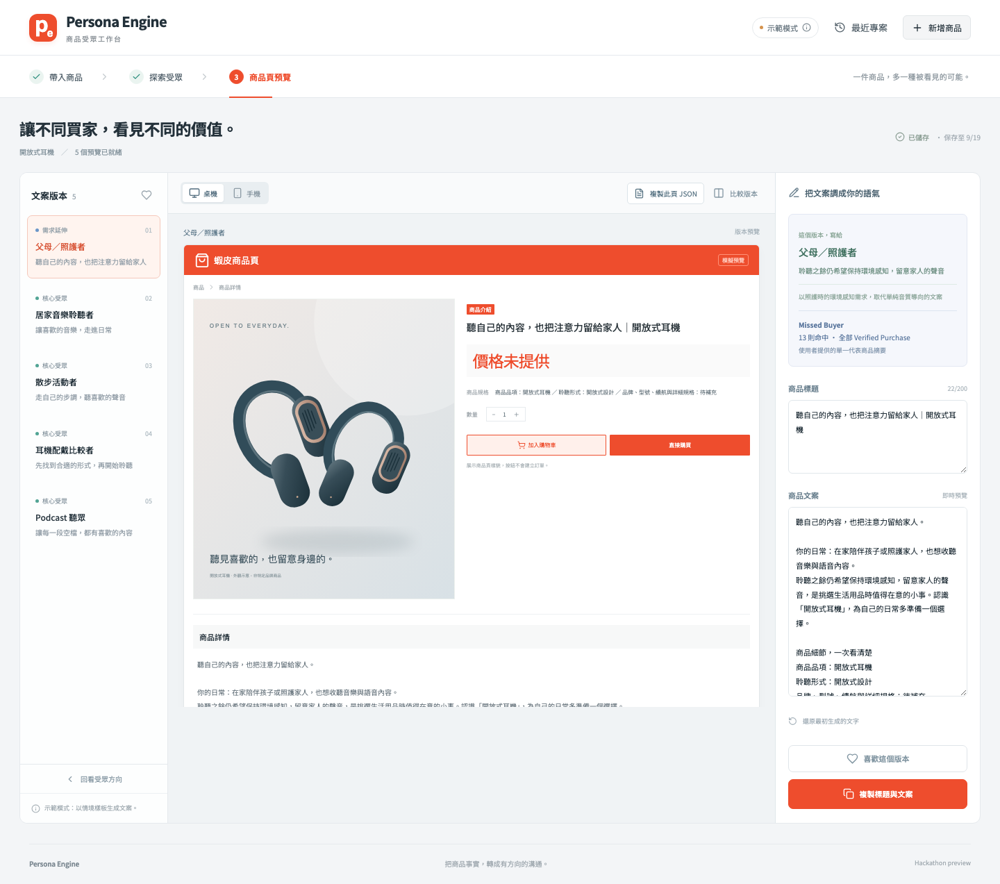
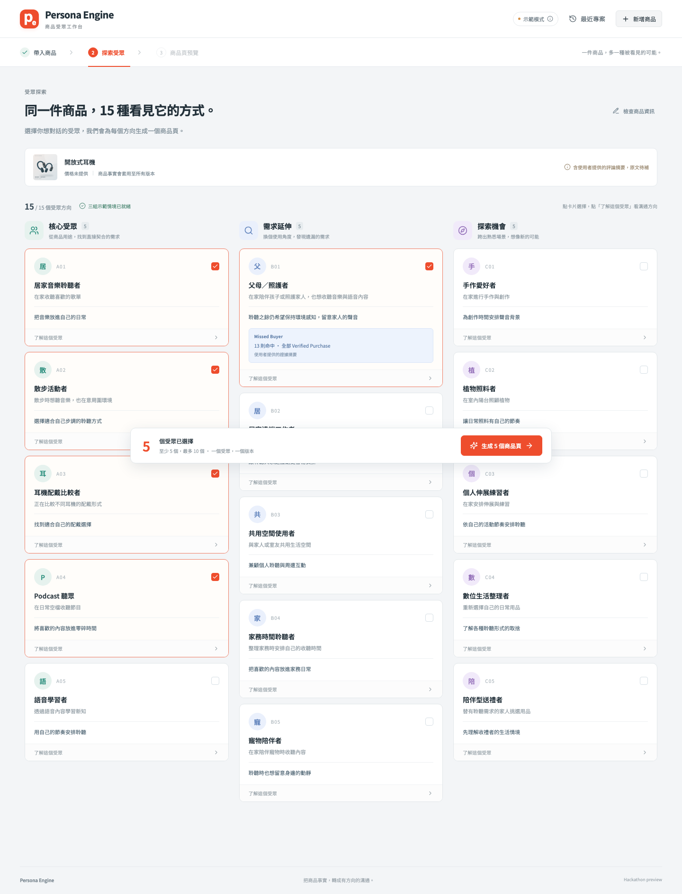
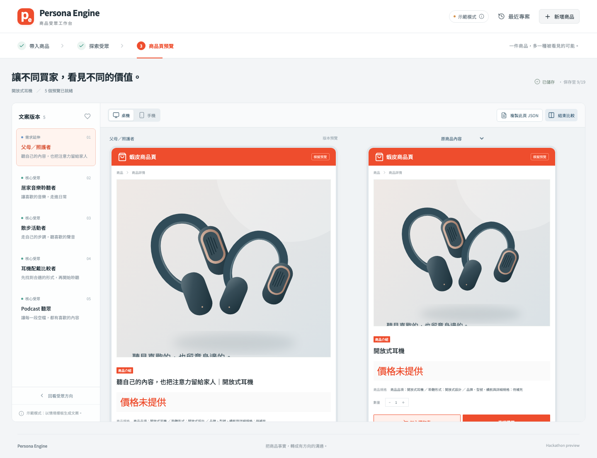
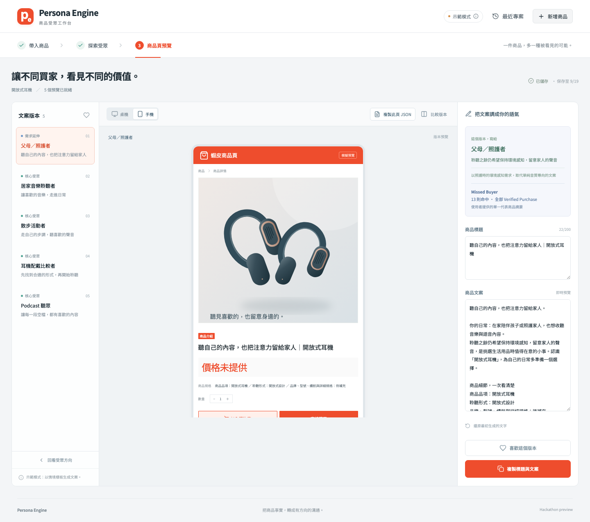
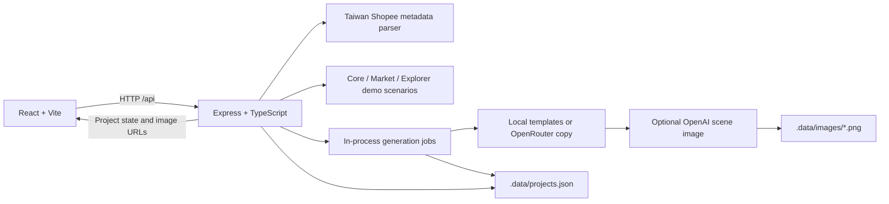

<p align="center">
  
</p>

<p align="center">
  <strong>English</strong> · <a href="README.zh-TW.md">繁體中文</a> · <a href="http://165.22.106.67/">Live demo</a> · <a href="https://claude.ai/code/artifact/460a9183-01f2-422d-bec5-9afa4009abb9">Pitch deck</a> · <a href="#quick-start">Quick start</a> · <a href="docs/README.md">Docs</a>
</p>

<p align="center">
  <a href="package.json"></a>
  <a href="http://165.22.106.67/"></a>
  <a href="#license"></a>
</p>

## Who else needs it?

**Persona Engine explores buyers a seller might never have pictured, then turns those use cases into listings written for them.** Start with what the product can actually do, find a plausible job in someone else's daily life, and bring that insight back to the product page.

Built for **Shopee Hackathon 2026**. [Try the live demo](http://165.22.106.67/) · [Read the pitch deck](https://claude.ai/code/artifact/460a9183-01f2-422d-bec5-9afa4009abb9)

## Same product. A different buyer.

A feature-first smart-plug listing describes scheduling and remote power control. For an **aquarium keeper**, the angle becomes a daily rhythm for aquarium lights. The product is the same; the reason to care changes.

| Product | Unexpected buyer | Communication angle | Case status |
| --- | --- | --- | --- |
| Smart Plug | Aquarium keeper | A lighting routine for the tank, including days away | Team-reported result in the deck |
| Open-ear headphones | Newborn caregiver | Listen to podcasts while staying aware of household sounds | Team scenario |
| USB-C Hub | Mobile makeup artist | Shoot, back up and deliver on location | Team scenario |

These are the deck's examples. They are not sales-lift results or verified product photography. A smart plug controls power; it does not add monitoring, a camera or communication. Appliance compatibility and electrical ratings still need checking against the actual model.

## How it works

The pitch follows three steps:

1. **Build people once.** Use review needs to form a shared persona registry: reviews → embeddings → clusters, with outliers retained for review → personas with contexts, jobs and source references.
2. **Explore product × persona.** Ask an LLM for plausible uses within the product's capabilities, returning a story, four sub-scores and structured JSON for each pairing.
3. **Bring it back to the listing.** Pick audiences, create one listing per audience, then compare, edit and copy. Product facts and price remain the common reference.



The deck illustrates this with **1,500 personas** and cites **Amazon Reviews 2023 (McAuley Lab)**. Its appendix identifies that registry size, vectors and clusters as illustrative; corpus scope and validated registry size await confirmation. The live demo separately presents a saved Smart Plug run as 1,500 historical evaluations with 15 selected personas. See [methodology](docs/methodology.md) for the evidence and implementation boundaries.

## Demo

**[Open the live demo →](http://165.22.106.67/)**

Click **「查看示範分析」** (View demo analysis) on the Amazon Smart Plug card. Inspect the 15 Explorer results and their four-dimensional scores, then click **「查看商品頁預覽」** (View listing previews) to open the saved listing workspace. At the 2026-09-12 check, 10 previews were ready.

The hosted entry point currently marks Shopee URL import **Coming Soon**. Use the saved analysis for the presentation walkthrough. Viewing existing results is not a fresh 1,500-persona run. Availability and saved-project expiry may change.

The deck's aquarium example is the lead story; the visible saved run contains other Smart Plug contexts such as lighting schedules, hard-to-reach switches, travel and pet care. Do not assume every deck example appears in this saved selection.

<details>
<summary>Repository demo screenshots: the earlier headphone workflow</summary>

These screenshots show the runnable repository baseline, not the newer hosted Smart Plug run. They use template copy and the bundled headphone illustration, with image generation disabled.









</details>

[Demo walkthrough and capture provenance →](docs/demo.md)

## Quick start

These commands run the source in this repository. Its built-in sample is open-ear headphones with seeded audiences; the hosted Smart Plug run and its evaluation data are not included in this checkout.

Use **Node.js 24** and npm. The original project validation used Node.js 24; this documentation pass also ran the tests and build on Node.js 26.5.0.

```bash
git clone https://github.com/c-cf/shopee-persona-engine.git
cd shopee-persona-engine
npm ci
npm run dev
```

Open **[http://127.0.0.1:5173](http://127.0.0.1:5173)**. The API listens on port **3001**; Vite proxies `/api` to it. With neither provider key configured, the demo uses local copy templates and the original product image, with no paid model requests.

In this repository build, try a Taiwan Shopee URL or choose **「手動輸入」** (Manual input). Supply a title of at least 2 characters and a description of at least 8 characters. Price and image are optional; missing values stay visibly incomplete. URL parsing reads public metadata and may fail; use manual input when it does.

### Optional models

```bash
cp .env.example .env
```

Set `OPENROUTER_API_KEY` for model-written copy, `OPENAI_API_KEY` for audience scene images, or both. Restart the server after changing `.env`; its values override inherited environment variables. **Adding keys does not enable research-based audience discovery.**

See [configuration](docs/configuration.md) for model defaults, provider inputs, retries, image storage and deployment constraints. Provider integrations are implemented, but real-key calls were not verified in this documentation pass.

### Checks and production build

```bash
npm test
npm run build
npm start
```

After building, open **[http://127.0.0.1:3001](http://127.0.0.1:3001)**. Express serves the built frontend and API together. This is a local production build, not a hosted deployment.

## Features

| Capability | Hosted demo | Runnable repository |
| --- | --- | --- |
| Audience discovery | Saved Smart Plug analysis: 15 Explorer personas with four sub-scores and Final Score | Three groups of five seeded scenarios; select 5–10 |
| Product input | URL import marked Coming Soon | Public Taiwan Shopee metadata parser, manual text and image upload |
| Listing workspace | 10 saved Smart Plug previews observed | Generate 5–10 titles/descriptions; compare desktop/mobile layouts |
| Editing and export | Editing controls and single-page JSON export are visible | Autosave, restore, favorites, copy and JSON export implemented |
| Models and recovery | Deployed provider configuration not verified | Optional OpenRouter copy, OpenAI scene images and separate retry checkpoints |

The public deployment was inspected through its UI; editing, generation and persistence were not exercised against shared data. The repository's tests cover the source behavior described in [architecture](docs/architecture.md).

## Architecture

The research workflow above describes the pitch. This diagram describes the **runnable repository baseline**; it does not claim to reproduce the deployed evaluation pipeline.



The frontend and backend share TypeScript contracts. Audience preparation and variant generation run inside the server process; JSON checkpoints allow unfinished work to resume after a restart. This version has no external job queue, database service or account system.

Generated images use product facts, audience context and listing text as prompts. **The original product image is not sent as an image input**, so generated scenes do not guarantee an exact product likeness. [Architecture and data flow →](docs/architecture.md)

## Persona Engine and Explorer Engine

**Persona Engine** is the complete product: understand potential buyers and turn the selected directions into listings. **Explorer Engine** is the product–persona pairing and scoring step. A reusable persona registry supplies contexts, jobs and source references rather than a list of identified customers.

Core, Market and Explorer remain the deck's broader audience categories. The public Smart Plug analysis currently shows **15 Explorer personas**; the repository baseline demonstrates five seeded scenarios in each of the three groups.

The deck's 1,500-persona illustration is the current presentation scale. Older repository notes mention a 10,000-persona goal; that is historical planning, not a claim about the current registry or deployed run.

## Methodology and ranking formula

The deck proposes four dimensions for **exploration priority**:

| Dimension | Weight | Question |
| --- | --- | --- |
| Product–Job Bridge | 30% | Can the product do the job? |
| Beer–Diaper Index | 30% | Is the connection unexpected, yet plausible? |
| Market Opportunity | 20% | How broad might the opportunity be? An LLM estimate. |
| Story Hook | 20% | How vivid and memorable is the scene? |

For sub-scores on a 0–100 scale, the proposed weighted geometric mean is:

```text
Final Score = 100 × (Bridge / 100)^0.30
                  × (Beer–Diaper / 100)^0.30
                  × (Market / 100)^0.20
                  × (Hook / 100)^0.20
```

This ranks hypotheses for exploration, not conversion probability or sales uplift. “Beer–diaper” is a metaphor, not a claim about verified retail history. The deck labels the displayed run results as team-reported, with raw JSON and qualification rules pending; the proposed formula does not rescore historical results.

The hosted UI displays these four dimensions and Final Score. The checked-in baseline's `defaultSelection` only prioritizes an existing evidence object before taking five entries; that UI preselection rule is separate from the research formula. [Methodology, sources and current code →](docs/methodology.md)

## Project structure

```text
.
├── src/                    # React flow, preview renderer, API client and styles
├── server/                 # Express API, demo engine, generation, images and tests
├── shared/                 # Shared types, demo product and single-page JSON export
├── public/                 # App favicon and bundled product illustrations
├── docs/
│   ├── glossary.md         # Domain vocabulary
│   ├── assets/brand/       # Logo, wordmark and bilingual hero
│   ├── assets/diagrams/    # Research workflow illustrations
│   ├── assets/screenshots/ # Captures from the running local demo
│   ├── adr/                # Scope decisions
│   └── archive/            # Earlier designs, interviews and work records
├── CONTRIBUTING.md
├── README.md               # English homepage
└── README.zh-TW.md          # Traditional Chinese homepage
```

`.data/` (saved projects and images), `.env` and build output are ignored by Git. The [documentation index](docs/README.md) separates current guides from historical design notes.

## Project status

There are three sources to keep in view: the [pitch deck](https://claude.ai/code/artifact/460a9183-01f2-422d-bec5-9afa4009abb9) describes the research method, the [hosted demo](http://165.22.106.67/) shows the saved Smart Plug experience, and this repository provides the listing application baseline.

At the 2026-09-12 check, remote `main` was `de9bb9a`; the newer hosted behavior could not be mapped to a published source revision. The repository baseline has no connected review corpus or vector retrieval. No measured sales uplift, Shopee account integration or live publishing is claimed.

The source saves projects for seven days after creation, with same-browser workspace access. Generated image links do not require the workspace key and expire with the project. Hosting does not establish production access guarantees. [Configuration and storage →](docs/configuration.md)

## Roadmap

- [x] Listing workspace with comparison, editing, copying and single-page JSON export.
- [x] Public Smart Plug demo with saved Explorer scores and listing previews, observed through the deployed UI.
- [ ] Publish the deployed source revision, evaluation inputs and raw result JSON for reproducibility.
- [ ] Confirm corpus scope, registry size/version and clustering/outlier methodology.
- [ ] Document historical scoring and qualification rules; evaluate the proposed ranking separately.
- [ ] Enable and validate product URL import in the hosted workflow.
- [ ] Publish real-provider latency, cost and factual-accuracy measurements.
- [ ] Confirm the project license, hosting/access requirements and recorded demo.

These are follow-up directions, without committed dates.

## Team and hackathon

Built for **Shopee Hackathon 2026**, as identified in the [team's pitch deck](https://claude.ai/code/artifact/460a9183-01f2-422d-bec5-9afa4009abb9), with source in [c-cf/shopee-persona-engine](https://github.com/c-cf/shopee-persona-engine).

The project asks “Who else needs it?” and follows that question through persona exploration to a listing a seller can review. Team names and individual roles have not yet been documented; [contributor history](https://github.com/c-cf/shopee-persona-engine/graphs/contributors) records code attribution.

## Contributing

See [CONTRIBUTING.md](CONTRIBUTING.md). Useful contributions include reproducible bug reports, tests for editing and recovery, source-backed evidence fixtures, and English/Traditional Chinese documentation fixes. Keep demo behavior distinct from research claims.

## License

**No license file is present.** Public source availability does not establish an open-source license. The maintainers still need to choose and add terms for the code and assets; this documentation change does not assign one. Shopee is referenced as the target marketplace, not as a claim of endorsement.
