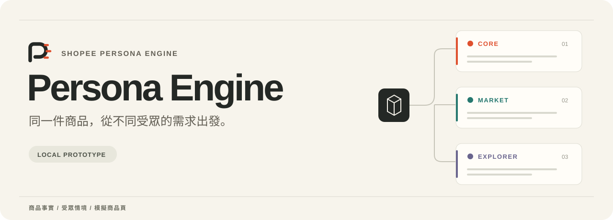
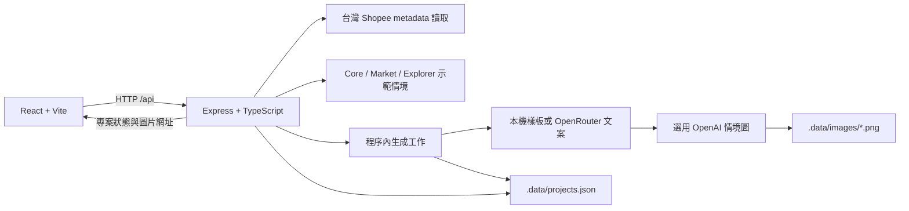

<p align="center">
  
</p>

<p align="center">
  <a href="README.md">English</a> · <strong>繁體中文</strong> · <a href="http://165.22.106.67/">線上 Demo</a> · <a href="https://claude.ai/code/artifact/460a9183-01f2-422d-bec5-9afa4009abb9">簡報</a> · <a href="#快速開始">快速開始</a> · <a href="docs/README.md">文件</a>
</p>

<p align="center">
  <a href="package.json"></a>
  <a href="http://165.22.106.67/"></a>
  <a href="#授權"></a>
</p>

## 誰還需要它？

**Persona Engine 探索賣家原本沒想到的買家，再把使用情境轉成為他們而寫的商品頁。** 從商品真正能做的事出發，找出它在另一種生活情境中能完成的任務，讓這個發現回到商品頁的溝通。

**Shopee Hackathon 2026** 專案。[體驗線上 demo](http://165.22.106.67/) · [查看簡報](https://claude.ai/code/artifact/460a9183-01f2-422d-bec5-9afa4009abb9)

## 同一件商品，另一種買家

以功能為主的智慧插座文案，介紹的是排程與遠端電源控制；面向**水族飼養者**時，切入點則是魚缸照明的每日作息。商品相同，值得關心它的理由不同。

| 商品 | 意想不到的買家 | 溝通角度 | 案例狀態 |
| --- | --- | --- | --- |
| Smart Plug | 水族飼養者 | 為魚缸燈光安排作息，外出時也能延續 | 簡報中的團隊回報結果 |
| 開放式耳機 | 新生兒照護者 | 聽 Podcast，同時留意家中聲音 | 團隊情境示例 |
| USB-C Hub | 外出工作的化妝師 | 現場拍攝、備份並交付內容 | 團隊情境示例 |

這些是簡報中的案例，不是銷售提升數據或經驗證的商品攝影。智慧插座控制的是供電，不會增加監控、攝影或通訊功能；設備相容性與電氣額定值仍須依實際型號確認。

## 如何運作

簡報以三個步驟說明方法：

1. **先建立可重用的人物樣態。** 從評論需求出發，經過 embedding、分群，並保留離群項目供檢視，建立包含情境、任務與來源參照的共用 persona registry。
2. **探索商品 × Persona。** 在商品能力範圍內，請 LLM 為每個配對提出合理用途，回傳故事、四項分數與結構化 JSON。
3. **把發現帶回商品頁。** 選受眾、為每個方向產生商品頁，再比較、修改與複製；商品事實與價格始終是共同依據。


簡報以 **1,500 personas** 說明流程，資料來源列為 **Amazon Reviews 2023（McAuley Lab）**；附錄註明集合規模、向量及分群為示意，corpus 範圍與經驗證的集合大小仍待確認。線上 demo 另將已儲存的智慧插座結果標示為 1,500 次歷史評估、選出 15 個 personas。詳見[方法文件](docs/methodology.md)的證據與實作界線。

## Demo

**[開啟線上 demo →](http://165.22.106.67/)**

在 Amazon Smart Plug 卡片按 **「查看示範分析」**，查看 15 個 Explorer 結果與四維分數，再按 **「查看商品頁預覽」** 開啟已儲存的工作區。2026-09-12 檢查時，已有 10 個預覽可查看。

部署版目前將 Shopee 網址匯入標為 **Coming Soon／即將推出**；簡報展示可從既有分析進入。瀏覽已儲存的結果不等於重新執行 1,500 個 personas 配對。網站可用狀態與專案到期時間可能變動。

簡報以水族飼養者為主故事；線上這批結果可見燈光排程、難以觸及的開關、旅行與寵物照護等其他情境，不能假設所有簡報案例都包含在目前選出的結果中。

<details>
<summary>Repository demo 截圖：較早的耳機操作流程</summary>

以下展示 repo 可執行基準版，不是較新的線上智慧插座分析。截圖使用樣板文案及內附耳機示意圖，停用圖片生成。


</details>

[Demo 操作與截圖來源 →](docs/demo.md)

## 快速開始

以下指令執行本 repository 的程式，內附開放式耳機與預設受眾情境；線上智慧插座分析及其評估資料尚未包含在此 checkout。

使用 **Node.js 24** 與 npm。原始驗證紀錄使用 Node.js 24；本次文件整理亦以 Node.js 26.5.0 執行測試與建置。

```bash
git clone https://github.com/c-cf/shopee-persona-engine.git
cd shopee-persona-engine
npm ci
npm run dev
```

開啟 **[http://127.0.0.1:5173](http://127.0.0.1:5173)**。API 使用 **3001** 埠，Vite 會將 `/api` 轉送至後端。兩個供應商金鑰皆未設定時，demo 使用本機文案樣板及原商品圖片，不會發出付費模型請求。

在本 repository 建置中，可嘗試台灣 Shopee 網址，或選擇 **「手動輸入」**。商品名稱至少 2 個字，描述至少 8 個字；價格與圖片為選填，缺漏資料會保留待補狀態。網址讀取僅擷取公開 metadata，可能失敗；遇到此情況可改用手動輸入。

### 選用模型

```bash
cp .env.example .env
```

設定 `OPENROUTER_API_KEY` 可啟用模型文案，設定 `OPENAI_API_KEY` 可啟用受眾情境圖片，也可同時啟用。修改 `.env` 後需重新啟動後端；檔案內的值會覆蓋啟動環境中的同名變數。**加入金鑰不會啟用研究型受眾探索。**

模型預設值、送出的資料、重試、圖片保存及部署限制見[設定指南](docs/configuration.md)。供應商接點已實作，但本次文件整理未以真實金鑰驗證呼叫。

### 檢查與正式建置

```bash
npm test
npm run build
npm start
```

建置後開啟 **[http://127.0.0.1:3001](http://127.0.0.1:3001)**，由 Express 一併提供前端與 API。這是本機正式建置，不代表已部署到公開網站。

## 功能

| 功能 | 線上 demo | Repository 可執行版本 |
| --- | --- | --- |
| 受眾探索 | 已儲存的智慧插座分析：15 個 Explorer personas，附四項分數及 Final Score | 三組各五個預設情境，選取 5–10 個 |
| 商品輸入 | 網址匯入標示即將推出 | 台灣 Shopee 公開 metadata、手動文字及圖片上傳 |
| 商品頁工作區 | 已觀察到 10 個智慧插座預覽 | 生成 5–10 組標題／描述，比較桌機與手機版面 |
| 編輯與匯出 | 可見編輯控制項與單頁 JSON 匯出 | 已實作自動保存、還原、喜歡標記、複製及 JSON 匯出 |
| 模型與恢復 | 未查驗部署版的供應商設定 | 選用 OpenRouter 文案、OpenAI 情境圖及各自的重試檢查點 |

線上版本以介面觀察為準，未對共用資料測試修改、生成或保存；repository 測試涵蓋的程式行為見[架構文件](docs/architecture.md)。

## 架構

上方研究流程對應簡報；下圖對應 **repository 可執行基準版**，不代表已重現線上的評估管線。



前後端共用 TypeScript 資料契約。受眾準備與文案生成在後端程序內執行，透過 JSON 檢查點讓未完成工作在重啟後繼續。目前沒有外部工作佇列、資料庫服務或帳號系統。

圖片生成以商品事實、受眾情境與文案作為提示。**商品原圖不會作為圖像輸入送出**，因此情境圖不保證精確還原商品外觀。[架構與資料流 →](docs/architecture.md)

## Persona Engine 與 Explorer Engine

**Persona Engine** 是完整產品：理解潛在買家，再把選定方向轉成商品頁。**Explorer Engine** 負責商品與 persona 配對及評分。可重用的人物樣態集合提供情境、任務與來源參照，不是已辨識身分的客戶名單。

Core、Market、Explorer 仍是簡報中的整體受眾分類。線上智慧插座分析目前展示 **15 個 Explorer personas**；repository 基準版則以三組各五個預設情境示範流程。

目前簡報以 1,500 personas 為示意規模；較早的 repo 文件曾提出 10,000 筆目標，屬於歷史規劃，不代表目前集合或部署執行規模。

## 方法與排序公式

簡報提出四個維度，用於判斷**探索優先順序**：

| 維度 | 權重 | 評估問題 |
| --- | --- | --- |
| Product–Job Bridge | 30% | 商品能否完成這個任務？ |
| Beer–Diaper Index | 30% | 連結是否出乎意料，但仍合理？ |
| Market Opportunity | 20% | 機會可能涵蓋多廣？由 LLM 估計。 |
| Story Hook | 20% | 情境是否具畫面感、容易記住？ |

各項為 0–100 分，提案採用加權幾何平均：

```text
Final Score = 100 × (Bridge / 100)^0.30
                  × (Beer–Diaper / 100)^0.30
                  × (Market / 100)^0.20
                  × (Hook / 100)^0.20
```

分數排序的是待探索假說，不是轉換機率或銷售提升。「啤酒與尿布」是比喻，不是經查證的零售歷史主張。簡報將展示結果標示為團隊回報，原始 JSON 與合格判定規則待補；提案公式不回溯重算歷史結果。

線上介面已顯示上述四個維度與 Final Score；目前 repo 的 `defaultSelection` 則只把具有證據物件的受眾排在前面，再取五個。這項介面預選規則與研究公式是不同層次。[方法、來源與現行程式 →](docs/methodology.md)

## 專案結構

```text
.
├── src/                    # React 流程、預覽元件、API 用戶端與樣式
├── server/                 # Express API、示範引擎、生成、圖片與測試
├── shared/                 # 共用型別、示範商品與單頁 JSON 匯出
├── public/                 # App favicon 與內附商品示意圖
├── docs/
│   ├── glossary.md         # 領域詞彙
│   ├── assets/brand/       # 標誌、字標與雙語 hero
│   ├── assets/diagrams/    # 研究流程圖
│   ├── assets/screenshots/ # 本機 demo 實際截圖
│   ├── adr/                # 範圍決策
│   └── archive/            # 歷史設計、訪談與工作紀錄
├── CONTRIBUTING.md
├── README.md               # 英文主版
└── README.zh-TW.md          # 繁體中文版
```

`.data/`（專案與圖片）、`.env` 及建置產物不納入 Git。[文件索引](docs/README.md)將現行指南與歷史設計紀錄分開，方便查閱。

## 專案狀態

目前可從三個來源理解專案：[簡報](https://claude.ai/code/artifact/460a9183-01f2-422d-bec5-9afa4009abb9)說明研究方法，[線上 demo](http://165.22.106.67/)展示已儲存的智慧插座體驗，本 repository 提供商品頁應用程式基準版。

2026-09-12 核對時，遠端 `main` 為 `de9bb9a`，較新的部署行為尚無法對應到公開的原始碼版本。Repo 基準版未連接評論 corpus 或向量檢索；不宣稱已量測銷售提升，也未提供 Shopee 帳號整合或實際上架。

程式設定為專案建立後保存七天，透過同瀏覽器工作區回訪。生成圖片的連結不要求工作區金鑰，隨專案到期。完成部署不等於已具備正式存取保障。[設定與保存方式 →](docs/configuration.md)

## Roadmap

- [x] 商品頁工作區，支援比較、編輯、複製及單頁 JSON 匯出。
- [x] 公開智慧插座 demo，已於部署介面觀察到既有 Explorer 分數與商品頁預覽。
- [ ] 公開部署版本的程式碼、評估輸入與原始結果 JSON，讓流程可重現。
- [ ] 確認 corpus 範圍、人物樣態集合的規模／版本及分群與離群值處理方法。
- [ ] 記錄歷史評分與合格判定規則，另行評估提案排序公式。
- [ ] 啟用並驗證部署版的商品網址匯入。
- [ ] 公開真實模型延遲、成本與事實正確性量測。
- [ ] 確認授權、部署／存取需求，並完成 demo 錄影。

以上是後續方向，尚無承諾時程。

## 團隊與黑客松背景

依[團隊簡報](https://claude.ai/code/artifact/460a9183-01f2-422d-bec5-9afa4009abb9)，本專案為 **Shopee Hackathon 2026** 作品，原始碼位於 [c-cf/shopee-persona-engine](https://github.com/c-cf/shopee-persona-engine)。

專案從「誰還需要它？」出發，經人物樣態探索，最後交付賣家能審閱的商品頁。團隊姓名與個別分工尚未記錄；[貢獻歷史](https://github.com/c-cf/shopee-persona-engine/graphs/contributors)可查看程式貢獻歸屬。

## 參與貢獻

請先閱讀 [CONTRIBUTING.md](CONTRIBUTING.md)。適合的貢獻包含可重現的錯誤回報、編輯與恢復流程測試、附來源的證據測試資料，以及中英文文件修正。文件應持續區分示範行為與研究主張。

## 授權

**目前沒有授權檔案。** 公開可讀的原始碼不等於已採用開源授權；程式與資產的授權條款仍待維護者選定，本次文件修改不代為指定。Shopee 是目標電商平台名稱，不代表官方背書。
