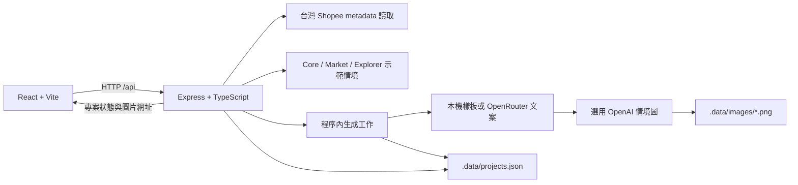

<p align="center">
  
</p>

<p align="center">
  <a href="README.md">English</a> · <strong>繁體中文</strong> · <a href="#demo">Demo</a> · <a href="#快速開始">快速開始</a> · <a href="docs/README.md">文件</a>
</p>

<p align="center">
  <a href="#專案狀態"></a>
  <a href="package.json"></a>
  <a href="#快速開始"></a>
  <a href="#授權"></a>
</p>

**Shopee Persona Engine 協助賣家把一件商品，轉成 5–10 個面向不同受眾的模擬商品頁。** 帶入商品事實、選擇受眾情境，再以模擬的 Shopee 版面比較、修改、標記喜歡及複製候選文案。

目前提供本機執行的繁體中文介面。受眾探索使用明確標示的示範情境；不設定 API 金鑰也能產生樣板文案，亦可選擇啟用模型文案與情境圖片。

## 想解決的問題

商品頁可能把規格寫得很完整，卻沒有說明商品如何融入買家的日常。賣家需要嘗試不同溝通角度，也需要在改稿時隨時核對價格、規格與其他商品事實。

## 如何處理

Persona Engine 把候選方向放進同一個工作區。每個選定受眾都有自己的標題與描述，可切換桌機、手機預覽，並與另一版本或原商品內容比較。賣家審閱後再複製帶走；服務不會實際發布到 Shopee。


## Demo

依[快速開始](#快速開始)啟動本機服務，按 **「載入示範商品」**、**「開始探索受眾」**，保留五個預選方向，再按 **「生成 5 個商品頁」**。

範例商品是開放式耳機。**父母／照護者**方向示範一種「Missed Buyer」：希望收聽內容，同時留意家人聲音的人。此方向附有**使用者提供的單一代表商品摘要：13 則命中評論，全部標示為 Verified Purchase**。目前沒有評論原文、來源連結、品牌或型號，服務也未自行查驗。這是值得探索的溝通假說，尚未證明這群人會購買目前商品。

品牌、價格與詳細規格保持待補；商品圖為品類外觀示意。


*擷取自本機執行的程式，使用樣板文案並停用圖片生成。介面為繁體中文，耳機圖是專案內附的示意圖。*

<details>
<summary>查看受眾選擇、原文比較與手機預覽</summary>


</details>

repo 目前未提供已部署的 demo 或錄影連結。[Demo 指南](docs/demo.md)收錄操作流程與預留的 GIF 拍攝計畫。

## 快速開始

使用 **Node.js 24** 與 npm。原始驗證紀錄使用 Node.js 24；本次文件整理亦以 Node.js 26.5.0 執行測試與建置。

```bash
git clone https://github.com/c-cf/shopee-persona-engine.git
cd shopee-persona-engine
npm ci
npm run dev
```

開啟 **[http://127.0.0.1:5173](http://127.0.0.1:5173)**。API 使用 **3001** 埠，Vite 會將 `/api` 轉送至後端。兩個供應商金鑰皆未設定時，demo 使用本機文案樣板及原商品圖片，不會發出付費模型請求。

若使用自己的商品，可嘗試台灣 Shopee 網址，或選擇 **「手動輸入」**。商品名稱至少 2 個字，描述至少 8 個字；價格與圖片為選填，缺漏資料會保留待補狀態。網址讀取僅擷取公開 metadata，可能失敗；遇到此情況可改用手動輸入。

### 選用模型

```bash
cp .env.example .env
```

設定 `OPENROUTER_API_KEY` 可啟用模型文案，設定 `OPENAI_API_KEY` 可啟用受眾情境圖片，也可同時啟用。修改 `.env` 後需重新啟動後端；檔案內的值會覆蓋啟動環境中的同名變數。**加入金鑰不會啟用研究型受眾探索。**

模型預設值、送出的資料、重試、圖片保存及部署限制見[設定指南](docs/configuration.md)。供應商接點已實作，但本次文件整理未以真實金鑰驗證呼叫。

### 檢查與正式建置

```bash
npm test
npm run build
npm start
```

建置後開啟 **[http://127.0.0.1:3001](http://127.0.0.1:3001)**，由 Express 一併提供前端與 API。這是本機正式建置，不代表已部署到公開網站。

## 功能

| 功能 | 目前行為 |
| --- | --- |
| 商品輸入 | 台灣 Shopee 公開 metadata、手動文字，以及最多 1.3 MB 的 PNG／JPG／WebP 圖片 |
| 受眾選擇 | 三組各五個示範情境，選取 5–10 個不同受眾 |
| 商品文案 | 每個受眾一組標題與描述，使用樣板或選用 OpenRouter |
| 受眾圖片 | 選用 OpenAI，依文字提示為每個受眾產生情境圖；圖片完成前即可編輯文案 |
| 審閱工作區 | 桌機／手機版面、兩版本比較，或與原商品內容比較 |
| 文字編輯 | 自動保存、還原最初生成稿、喜歡標記、複製目前文字 |
| 調整受眾 | 可增減選擇；重新勾回受眾時，恢復先前編輯的版本 |
| 匯出 | 複製目前單頁 JSON，包含最新文字、商品、受眾與圖片資訊 |
| 恢復進度 | 專案本機保存七天、同瀏覽器回訪、進度持久化及失敗重試 |

## 架構



前後端共用 TypeScript 資料契約。受眾準備與文案生成在後端程序內執行，透過 JSON 檢查點讓未完成工作在重啟後繼續。目前沒有外部工作佇列、資料庫服務或帳號系統。

圖片生成以商品事實、受眾情境與文案作為提示。**商品原圖不會作為圖像輸入送出**，因此情境圖不保證精確還原商品外觀。[架構與資料流 →](docs/architecture.md)

## Persona Engine 與 Explorer Engine

「Persona Engine」是應用程式名稱；原先規劃的研究流程比目前的 demo 實作更廣。

| 層次 | 原定用途 | 目前實作 |
| --- | --- | --- |
| Core | 找出與商品用途直接相關的受眾 | 五個預設情境 |
| Market | 從評論佐證找出需求 | 五個預設情境；指定耳機 demo 有一份使用者提供的證據摘要 |
| Explorer | 在人物樣態集合中探索較不直覺的情境 | 五個預設假說，沒有 10K 推論 |
| Persona Factory / Universe | 建立有版本的人物樣態集合，原始目標為 10,000 筆 | 尚未接入 |

`core`、`market`、`explorer` 是 demo 的分組識別名稱，不代表三條研究引擎已在執行。[方法與證據界線 →](docs/methodology.md)

## 方法與排序公式

目前程式採用的是**預選規則**，不是市場排序模型：

```text
priority(buyer) = 有 buyer.evidence 時為 1，否則為 0
preselected = 依 priority 穩定遞減排序後，取前 5 個
```

同分時維持預設情境的順序。指定耳機 demo 會在 Market 準備完成後初始化選擇：父母／照護者優先，其後是前四個 Core 受眾。其他商品在 Core 準備完成後初始化。後續組別到齊時，不會覆蓋使用者的選擇。

目前沒有商品契合分數、新穎性分數、uplift 估計、向量檢索或加權排序公式。程式只檢查證據物件是否存在，沒有評估它的品質。[方法文件](docs/methodology.md)列出對應程式與後續研究工作。

## 專案結構

```text
.
├── src/                    # React 流程、預覽元件、API 用戶端與樣式
├── server/                 # Express API、示範引擎、生成、圖片與測試
├── shared/                 # 共用型別、示範商品與單頁 JSON 匯出
├── public/                 # App favicon 與內附商品示意圖
├── docs/
│   ├── assets/brand/       # SVG 標誌、字標、雙語 hero 與流程圖
│   ├── assets/screenshots/ # 本機 demo 實際截圖
│   └── adr/                # 原始範圍決策
├── CONTEXT.md              # 領域詞彙
├── CONTRIBUTING.md
├── README.md               # 英文主版
└── README.zh-TW.md          # 繁體中文版
```

`.data/`（專案與圖片）、`.env` 及建置產物不納入 Git。[文件索引](docs/README.md)將現行指南與歷史設計紀錄分開，方便查閱。

## 專案狀態

目前是具備完整編輯流程的**本機黑客松原型**。尚無 Shopee 登入、Seller Center 整合、實際上架、評論 corpus、向量搜尋或完整 10K Explorer，也不衡量轉換率提升。

專案於建立七天後到期，回訪依賴同一瀏覽器保存的工作區金鑰。圖片連結使用隨機 ID，但不檢查工作區金鑰；持有有效連結的人可在到期前讀取圖片。公開部署前仍需決定存取控制與部署方式。[運作細節 →](docs/configuration.md)

## Roadmap

前兩項是已實作範圍，其餘由設計紀錄與本次文件盤點整理，尚無承諾時程。

- [x] 商品輸入、示範受眾與 5–10 個可編輯商品頁預覽。
- [x] 選用文案／圖片供應商、保存改稿與失敗恢復。
- [ ] 補齊評論原文、來源連結與可重現的證據擷取流程。
- [ ] 接入有版本的人物樣態集合、Persona Factory 與檢索流程。
- [ ] 實作並評估完整 Explorer；先定義排序公式，再呈現分數。
- [ ] 量測真實供應商的延遲、成本與事實正確性，公開評估方式。
- [ ] 決定部署、存取控制與持久化儲存需求。
- [ ] 確認專案授權並發布 demo 錄影。

## 團隊與黑客松背景

本專案是 Shopee 黑客松作品，程式位於 [c-cf 的 repository](https://github.com/c-cf/shopee-persona-engine)。第一版優先交付賣家的完整審閱流程：商品事實 → 選擇受眾 → 可編輯的模擬頁面。詳見[範圍決策](docs/adr/0002-hackathon-first-version.md)。

repo 尚未記載團隊名單、成員分工或活動屆次。目前可由[貢獻紀錄](https://github.com/c-cf/shopee-persona-engine/graphs/contributors)查看程式貢獻者，但不宜將其視為完整黑客松團隊名單。

## 參與貢獻

請先閱讀 [CONTRIBUTING.md](CONTRIBUTING.md)。適合的貢獻包含可重現的錯誤回報、編輯與恢復流程測試、附來源的證據測試資料，以及中英文文件修正。文件應持續區分示範行為與研究主張。

## 授權

**目前沒有授權檔案。** 公開可讀的原始碼不等於已採用開源授權；程式與資產的授權條款仍待維護者選定，本次文件修改不代為指定。Shopee 是目標電商平台名稱，不代表官方背書。
