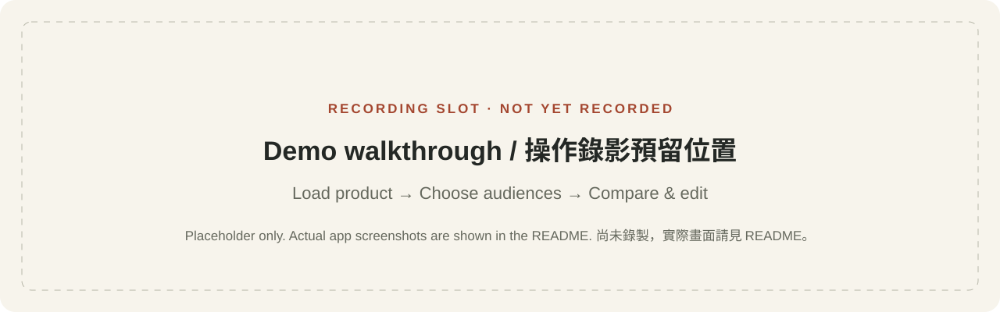

# Demo guide / Demo 指南

[Docs](README.md) · [English](../README.md) · [繁體中文](../README.zh-TW.md)

## Hosted Smart Plug walkthrough / 線上智慧插座展示

[Open the live demo](http://165.22.106.67/) · [Pitch deck](https://claude.ai/code/artifact/460a9183-01f2-422d-bec5-9afa4009abb9)

1. Open the Amazon Smart Plug card's **「查看示範分析」** link.
2. Inspect the 15 Explorer personas, four sub-scores and Final Score. The site
   describes them as a saved run from 1,500 historical evaluations, with 15
   experiment-selected personas; this is not a new full run on page load.
3. Open **「查看商品頁預覽」** to view saved listings. At the 2026-09-12 check,
   10 previews were ready. The UI exposes comparison, editing and single-page JSON export.

開啟首頁的智慧插座示範分析，查看 15 個 Explorer 結果與評分，再進入已有的商品頁預覽。此路徑用於展示已存結果，不代表重新執行全量配對。檢查時有 10 個預覽；僅以介面確認，未對共用資料執行改稿、生成或保存驗證。

The deployed URL importer is marked **Coming Soon**. The deck's broader journey
starts from product input, but the hosted demo currently enters through saved analysis.
The aquarium case leads the pitch; the saved selection observed online contains
other lighting, travel and pet-care contexts. Its source revision and raw evaluation
JSON are not published in the repository baseline checked for this documentation.
The project UI shows a seven-day expiry, so a saved analysis may later be unavailable.

部署版商品網址輸入標示即將推出，展示時從既有分析進入。水族案例是簡報主故事，線上本批可見其他燈光、旅行與寵物情境；不要宣稱目前已顯示所有簡報案例。此部署的程式版本及原始評估 JSON 尚未對應至 repo，且專案有七天期限，日後可能無法開啟。

## Repository walkthrough / Repo 基準版操作流程

Start the app using the homepage quick start. With both provider keys unset, the
following walkthrough uses bundled data, template copy and the original illustration.

依首頁快速開始啟動，兩個供應商金鑰皆不設定時，以下流程使用內附資料、樣板文案與原商品示意圖。

1. Click **「載入示範商品」** (Load demo product), inspect the missing specifications,
   then click **「開始探索受眾」** (Explore audiences).
2. Inspect Core, Market and Explorer: 15 scenarios in total. Read the evidence note
   on **父母／照護者** (parents/caregivers). Keep the five preselected directions or
   select 5–10 distinct audiences.
3. Click **「生成 5 個商品頁」** (the number follows the selection). Open the
   parents/caregivers version and inspect its title and description.
4. Edit the title, mark the version as a favorite and compare it with the original
   using **「比較版本」**. Try **「手機」** to inspect the mobile listing layout.
5. Copy text or **「複製此頁 JSON」**. Verify the copy contains the latest edit.
   Refresh to check saved state. Return to **「回看受眾方向」**, change a selection,
   then update the pages; reselect a removed audience to recover its edited version.

依序載入商品、檢查待補規格、探索受眾，再生成 5–10 個商品頁。閱讀父母／照護者的證據限制，修改標題、標記喜歡、比較原文並切換手機版。最後複製文字或單頁 JSON，確認是最新改稿；重新整理確認保存，再返回受眾頁測試增減與恢復。

## Baseline screenshots / 基準版截圖

The PNG files below are **actual screenshots of the earlier repository baseline**, not captures of the hosted Smart Plug experience. They were captured
from source commit `de9bb9ab292df74fbf035e86512fa0d6c7f35fec` on 2026-09-12 using a
1440 × 1000 browser viewport, with full-page capture. Copy mode: `template`. Image
mode: `disabled`. All product pictures are the repository's original illustration.
No generated model output or live Shopee data was used for these captures.

以下 PNG 是實際程式截圖，來源與環境如上。全部使用樣板文案、停用圖片生成；商品圖為原始示意圖，未使用模型產出或即時 Shopee 資料。

| File | Shows / 內容 |
| --- | --- |
| [Audience explorer](assets/screenshots/audience-explorer.png) | All three groups, selection state and evidence note／三組受眾、選取狀態與證據註記 |
| [Listing workspace](assets/screenshots/listing-workspace.png) | Parents/caregivers version and editor／父母與照護者版本及編輯區 |
| [Original comparison](assets/screenshots/compare-original.png) | Candidate versus original product text／候選稿與原商品內容比較 |
| [Mobile preview](assets/screenshots/mobile-preview.png) | Mobile listing format inside a desktop workspace／桌機工作區內的手機商品頁版型 |

The last image demonstrates the app's mobile-preview toggle, not a capture from a
physical phone. UI text remains Traditional Chinese in both READMEs.

最後一張展示程式的手機預覽切換，不是實體手機截圖；兩版 README 均使用原生繁中介面畫面。

## Reserved recording slot / 錄影預留位置

**Status: no recording yet.** Reserve `docs/assets/screenshots/demo-walkthrough.gif`
for a real recording of the walkthrough above. This path is a future asset name,
not a link to an existing file. A poster placeholder is provided below; it is
explicitly labeled and is not presented as a working demo.

**狀態：尚未錄製。** 上述路徑預留給實際操作錄影，不是現有檔案連結。下方為明確標示的封面佔位，不代表已有可播放 demo。

Suggested pitch recording sequence: introduce the Smart Plug/aquarium story → open
the hosted saved analysis → inspect four-dimensional scores → open listing previews
→ demonstrate comparison. Record editing or generation in a separate test project
only after confirming it is not the shared presentation data. Keep
labels readable, omit idle waits, avoid keys or private customer data, and retain
the visible demo labels. If a GIF becomes too large, publish an MP4 recording and
use a screenshot as its linked poster. Replace this placeholder only after the
recording exists, and document whether template or model generation was used.

建議錄下智慧插座／水族主故事、線上既有分析、四維評分及商品頁比較；若要展示改稿或生成，應使用獨立測試專案，避免修改共用展示資料。保留 demo 標示，略過空等並維持文字可讀。GIF 過大時可使用 MP4 搭配截圖封面；錄製完成後才替換佔位，並註明使用樣板或模型模式。
